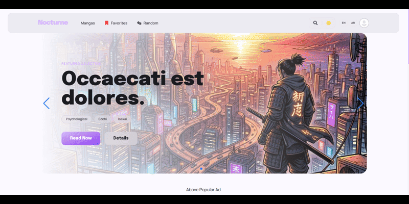
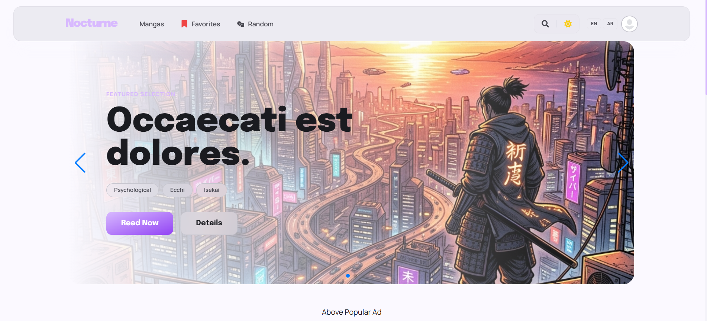
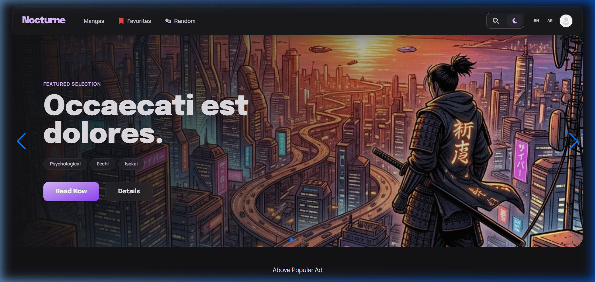
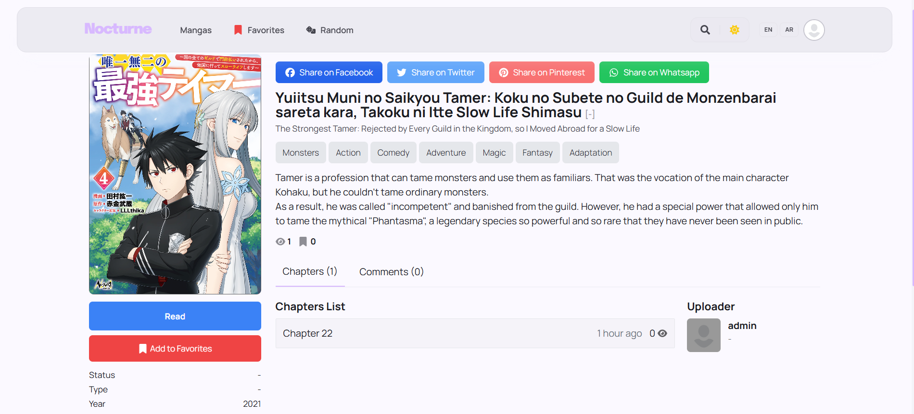
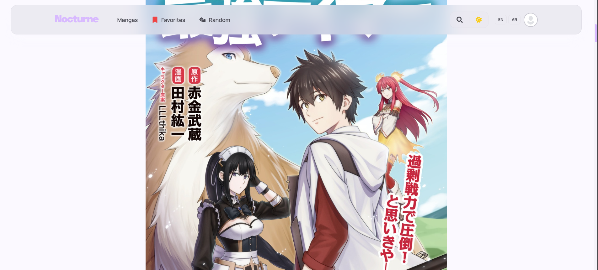
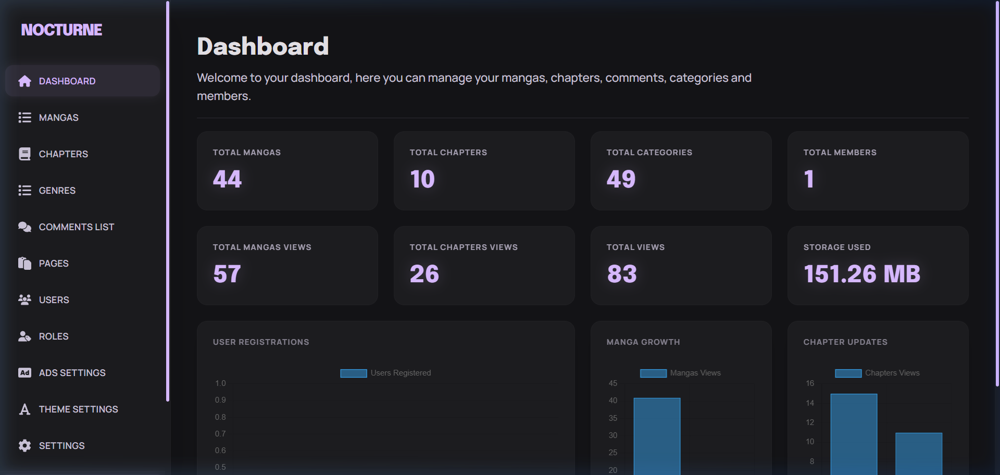

# 📖 Manga Reader

[](https://laravel.com)
[](https://www.php.net/)
[](https://tailwindcss.com/)
[](LICENSE)

A high-performance, enterprise-grade Manga Management and Reading platform built with **Laravel 11**. This project is designed for scalability, user engagement, and seamless content delivery.

---

## 🎥 Demo & Screenshots

### 🎬 End-to-End Flow Demo
Experience the core functionalities of the manga reader directly: smooth navigation, fast loading, and advanced theme switching.


### 📸 Application Interface

<details>
  <summary><b>Home Page & Sliders (Light Theme)</b></summary>
  
  
  *Dynamic homepage with recent updates, top-rated lists, and interactive manga sliders.*
</details>

<details>
  <summary><b>System-Aware Dark Mode</b></summary>
  
  
  *Full support for dark mode, allowing a comfortable reading experience in low-light environments.*
</details>

<details>
  <summary><b>Rich Manga Details</b></summary>
  
  
  *Comprehensive manga metadata, chapter lists, bookmarking options, and rating system.*
</details>

<details>
  <summary><b>Immersive Chapter Reader</b></summary>
  
  
  *Clean and optimized reader interface featuring responsive layouts for seamless browsing.*
</details>

<details>
  <summary><b>Admin Dashboard & Analytics</b></summary>
  
  
  *Powerful dashboard providing insights, role-based controls, and complete content lifecycle management.*
</details>

---

## 🚀 Key Features

### 📚 Content Management
- **Manga Lifecycle**: Full CRUD for Manga series, including metadata like genres, tags, and status.
- **Chapter System**: Hierarchical management of chapters and volumes.
- **Image Processing**: Dynamic page rendering with optimization using **Intervention Image**.
- **Chunked Uploads**: Seamlessly handle large manga files with robust chunked uploading logic.

### 👤 User Experience
- **Advanced Auth**: Secure authentication powered by **Laravel Fortify** and **Socialite** (Social Login).
- **Engagement Loop**: 
  - **Bookmarks**: Save and track reading progress.
  - **Social Layer**: Follow authors/users and build community via **Acquaintances**.
  - **Comments & Reactions**: Interactive feedback system with sentiment-based reactions.
- **Themeable Interface**: Multi-theme support using **Laravel Themer** for a personalized reading experience.

### ⚙️ System & Administration
- **Granular RBAC**: Role-Based Access Control using **Spatie Permissions**.
- **Dynamic Dashboard**: Full control over sliders, menus, advertisements, and site settings.
- **Performance Optimized**: Leverages **Fast Paginate** for high-load catalogs and **Vite** for lightning-fast asset delivery.
- **Reliability**: Automated scheduled backups via **Spatie Laravel Backup**.

---

## 🛠️ Technology Stack

| Layer | Technology |
| :--- | :--- |
| **Backend** | Laravel 11, PHP 8.2 |
| **Database** | MySQL / PostgreSQL |
| **Frontend** | Blade, Vanilla JS, Tailwind CSS, Vite |
| **Security** | Laravel Fortify, Sanctum, Honeypot |
| **DevOps** | Spatie Backup, Cloudflare Ready |

---

## 🏗️ Architecture Overview

The system follows a modular architecture:
- **Service Layer**: Decoupled business logic for complex operations (Manga upload, Chapter processing).
- **Theme Layer**: Isolated view logic for customizable UI.
- **API First**: Ready for mobile integration with **Sanctum** tokens.

---

## 🆕 Recent Updates
- **Theme System**: Converted theme variables to RGB channels for Tailwind opacity support and refactored views for project-wide light/dark mode support.
- **Advanced Dark Mode**: Implemented advanced dark mode with system sync, smooth transitions, and dynamic icon swapping.
- **Home Slider**: Enabled autoplay, looping, and resolved initialization and styling issues on the home page.
- **MangaDex Integration**: Implemented MangaDex integration with automated chapter syncing and image processing utilities.

---

## 🛠️ Getting Started

### Prerequisites
- PHP 8.2+
- Composer
- Node.js & NPM
- MySQL 8.0+

### Installation

1. **Clone the repository**
   ```bash
   git clone https://github.com/Bril3d/manga-reader.git
   cd manga-reader
   ```

2. **Install dependencies**
   ```bash
   composer install
   npm install
   ```

3. **Environment Setup**
   ```bash
   cp .env.example .env
   php artisan key:generate
   ```

4. **Run Migrations & Seeders**
   ```bash
   php artisan migrate --seed
   ```

5. **Start the application**
   ```bash
   npm run dev
   php artisan serve
   ```

---

## 🤝 Contributing

Contributions are welcome! Please feel free to submit a Pull Request.

## 📄 License

This project is open-sourced software licensed under the [MIT license](LICENSE).

---

<p align="center">
  Built with ❤️ for the Manga Community.
</p>
